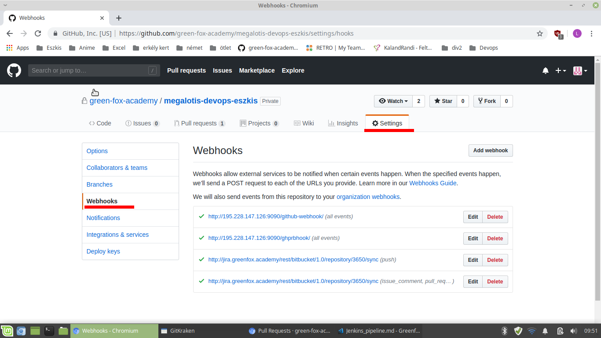
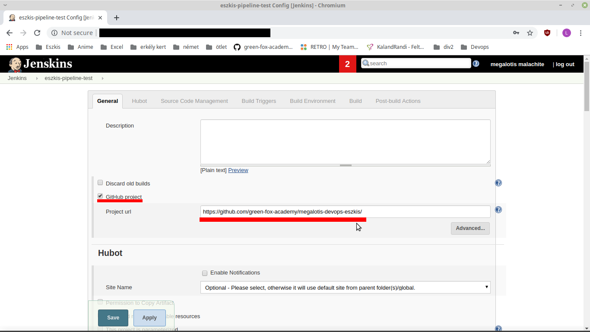
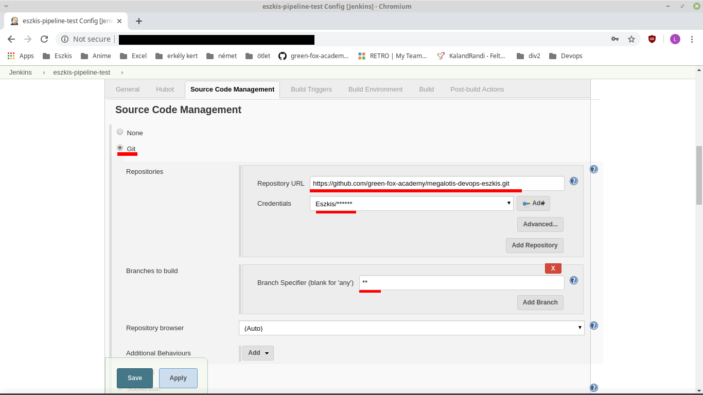

# Jenkins pipeline

For you need a running Jenkins server, and a GitHub user.

## Set up GitHub repo

You can use an existing repo, or can create a new one. After that you have to go to "Settings". Here you have to go to "Webhooks".

For now you finished with GitHub, now you have to set up your Jenkins project.

## Set up Jenkins

You have to sing in to Jenkins. Go to "New Item" in the top left corner. Here you can select the type of your project, and give it a name. I recomend "Freestle project" for basic Jankins GitHub connection. After you gave a name, and selected project type, press "OK" on bottom left corner. On the next page you have to set up how should the project work.

### General

First you have to select "GitHub Project", and have to write in the repo's url. (example: https://github.com/GitHub-Username/Repo-Name)

### Source Code Management

You have to go down to the "Source Code Management" section. Here you need to select "Git", and add the following informations. Repo's url, your credentials, and which brach should the Jenkins to watch.

Example: repo's url: https://github.com/GitHub-Username/Repo-Name.git
For credentials you can use an existing one, or you need to create a new one with your GitHub credentials. If you have to create a new one click on the "Add" button and follow the instuctions.

For "Branch Specifier" you can select a specific branch for Jenkins, or leave it empty, then it will watch all branch.

### Build Triggers

In "Build Triggers" you need to select "GitHub Pull Request Builder". In here you need to click on "Advenced..." and look for "Build every pull request automatically without asking (Dangerous!)." ad check it in.

### Build

Last thing you have to set up, is what should jenkins do on Pull Requests. Click on "Add build step" and select "GitHub PR: set 'pending' status". This will tell GitHub, to wait for check from Jenkins. After add "Execute shell" build step. Here you can add a code that check for errors, or use it to call a program, that check everythng for you.

After everything is set click on "Save" in the bottom left corner.

## Set up webhook on GitHub repo

You have to go back to the repo, where you left it. We have to add two webhhooks to your repo. In "Settings" go to "Webhooks", and click on "Add webhook". 

### GitHub webhook

For URL type in a similar url: http://Your-Jenkins_url:port/github-webhook/

Select "Content type" to be "application/json". Your webhook should send everything, and should be "Active". Then click on "Add webhook". Your first webhook is ready. 

### PR webhhok

For URL type in a similar url: http://Your-Jenkins_url:port/ghprbhook/

Select "Content type" to be "application/json". Your webhook should send everything, and should be "Active". Then click on "Add webhook". Your second webhook is ready.

If you go back to "Settings/Webhooks" you should see your two webhook. If both of them are up and running there should be a green tick next to it.

You set up everything, and it should run perfectly. 