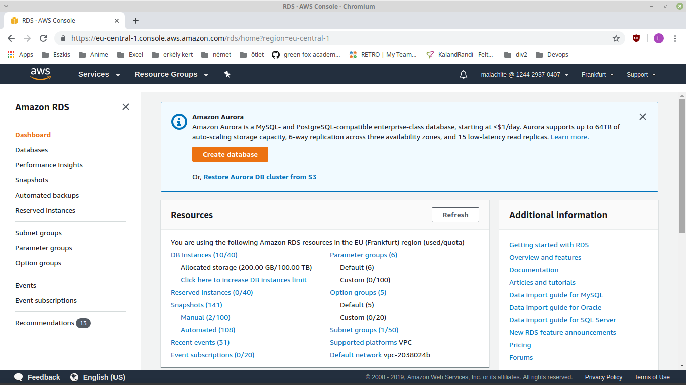
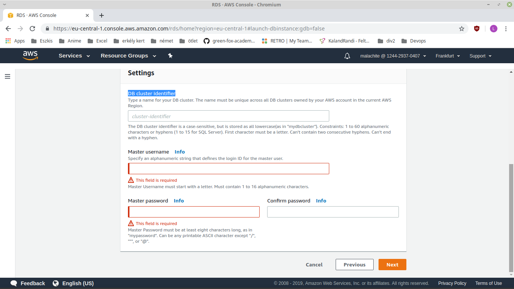
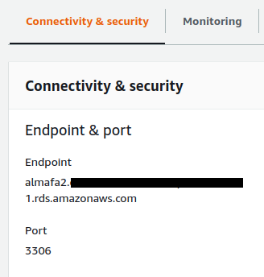

# DB in the cloud

## Create a new RDS in AWS

You have to sign in to AWS, and go to "Services". Here look up RDS, or write it in to the search bar. This will bring you to the RDS's main page. It should look like this.



### Select DB type

Here click on "Create database", then this will start a process to create an actual DB. First you have to select the type of DB you would like to setup. For the example we will set up a MYSQL DB. After you selected the type click on next, in the bottom right corner.

### Select use case

In the next page you can choose the "use case". Depending on what you going to use this DB you can choose from 3 differetn type. For now we will use "Production - Amazon Aurora". After selection click on "Next".

### Specify DB details

In the next page you can specify DB details, which mean that you can choose capacity type, DB engine verison,  DB instance class and Multi-AZ deployment. For easy setup you sould choose "Serverless" capacty type. This will scale resources based on your workload.

Next you need to add "Master username", "Master password" and "DB cluster identifier". You need these information later, to connect to the DB. After that you need to click on the "Next" button.



### Configure advanced settings

Here you need to configure your advenced settings for your DB. For basic useage, and testing I reccomend to leave everything as it is. All you need now is to click on "Create database" button on the bot right corner, and your DB is running.

## Communicate with your RDS

For that you need your DB's endpoint, port and MYSQL plugin to your console. You can find your DB's endpoint, and port the DB's informations. You need to go to the "Connectivity & security" section.



If you have all the information you need to open your console, and type in the following code.

``` mysql -h <RDS's endpoint> -P <port> -u <master username> -p ```

After that, you need to type in the master password, that you gave earlier.
If everything went fine you should see something like this.

```
Welcome to the MySQL monitor.  Commands end with ; or \g.
Your MySQL connection id is 350
Server version: 5.6.40-log MySQL Community Server (GPL)

Type 'help;' or '\h' for help. Type '\c' to clear the buffer.

mysql>
```

If you need more help, go to this [link](https://docs.aws.amazon.com/AmazonRDS/latest/UserGuide/USER_ConnectToInstance.html).