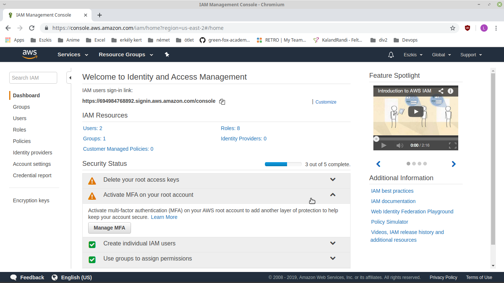

# Deploying NodeJS to EBS via AWSCLI
## Install EB CLI to your computer

The following AWS site helps you to install EB CLI to your computer. It has a complete solution for Window, macOS, Linux, or even virtualenv. To fisit the site clink on the [link](https://docs.aws.amazon.com/elasticbeanstalk/latest/dg/eb-cli3-install.html)

## Require your access id and secret key from AWSUtilizing_artifact_repositories2

Log in to your account in aws, then go to IAM set up page. It should look like this:



Here click on "Activate MFA on your root account" and then to "Manage MFA". Here click on "Access keys (access key ID and secret access key)" to show your access key. If you don't have one create a new one.  From here download your access id and secret key.

## Create a foldel for your EB, and start setting up your application

Useing your console, create a folder in you computer, which will be used for EB. 
After the folder is created, you need to enter into it. Using the command line you need to set up your new EB application by entering the following command:

``` eb init ```

### Region selection

Fist you have to select the Region you would like to set up you application. The following lines will be showed in your command line, and you have to select one from it.

```
Select a default region
1) us-east-1 : US East (N. Virginia)
2) us-west-1 : US West (N. California)
3) us-west-2 : US West (Oregon)
4) eu-west-1 : EU (Ireland)
5) eu-central-1 : EU (Frankfurt)
6) ap-south-1 : Asia Pacific (Mumbai)
7) ap-southeast-1 : Asia Pacific (Singapore)
8) ap-southeast-2 : Asia Pacific (Sydney)
9) ap-northeast-1 : Asia Pacific (Tokyo)
10) ap-northeast-2 : Asia Pacific (Seoul)
11) sa-east-1 : South America (Sao Paulo)
12) cn-north-1 : China (Beijing)
13) us-east-2 : US East (Columbus)
14) ca-central-1 : Canada (Central)
15) eu-west-2 : EU (London)
(default is 3):
```

You can select one Region by write it's number into console, and hit enter.

### Addin your Access key ID, and Secret access key

Console will ask for your access key ID, and Secret access key. You can type in the codes, or use the "Shift+Ins" paste the code in.

```You have not yet set up your credentials or your credentials are incorrect
You must provide your credentials.
(aws-access-id): AKIAJOUAASEXAMPLE
(aws-secret-key): 5ZRIrtTM4ciIAvd4EXAMPLEDtm+PiPSzpoK
```

### Give your application a name

After giving your keys you need to name your new application. It will have a default name based on your folder name. If you want you can change it to anything you want, as long as it's no used by someone else.

```
Enter Application Name
(default is "aws_with_docker"): 
Application aws_with_docker has been created.
```

### Platform selection

Next you need to select what kind of platfrom do you want to run on AWS EB. A list of choice will appear in console, and you have to choose from it, as you did in the Region selection. For Node.js you have to write 7.

```
Select a platform.
1) Node.js
2) PHP
3) Python
4) Ruby
5) Tomcat
6) IIS
7) Docker
8) Multi-container Docker
9) GlassFish
10) Go
11) Java
(default is 1):
```

### Set up SSH

Later you can choose to set up SSH for your instances. It is not mandatory.

```
Do you want to set up SSH for your instances?
(y/n): n
```

## Deploy your application

### Run own program, or choose example application

Before deploy application you need to copy all files, and folder into the created folder. If you dont have any, then the process will use the basic application provided by AWS.

### Set up AWS resources to run application

You can do it simply by typeing in the following code into console.

```
eb create
```

### Enter enviroment name

You need to give a name to your application. It has a default name, but you can change it, as long there is no other application that is useing the same name. It will look like this:

```
Enter Environment Name
(default is sample-app-dev):
```

### Choose DNC Cname

You need to give a URL to your application. It has a default URL, but you can change it, as long there is no other application that is useing the same name. It will look like this:

```
Enter DNS CNAME prefix
(default is sample-app-dev): 
```

### Choose balancer type

After you gave name to you application you need to select the load balancer. For basic server I reccomend "network". You can choose it by write in the number of the selected balancer.

```
Select a load balancer type
1) classic
2) application
3) network
(default is 1): 1
```
### Finish 

If everthing went as we planned, it will take a few minutes to set up the whole thing. It is totally fine to wait 5-10 minutes. In the end console will show us the following message:

```
INFO: Successfully Launched Environment:
```

### Extra info

If you want to know more how to monitor, and shut down your server, click on the following [link](https://aws.amazon.com/getting-started/tutorials/deploy-app-command-line-elastic-beanstalk/).