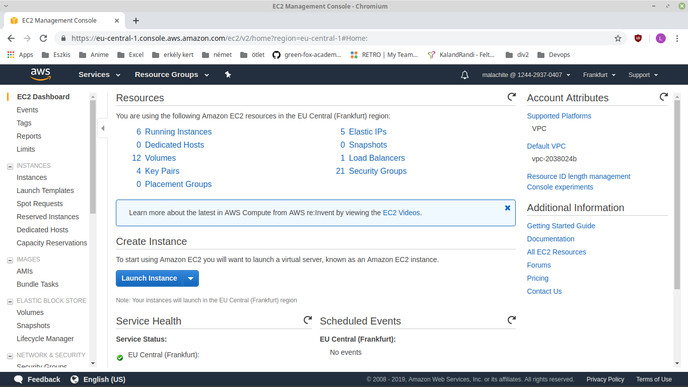
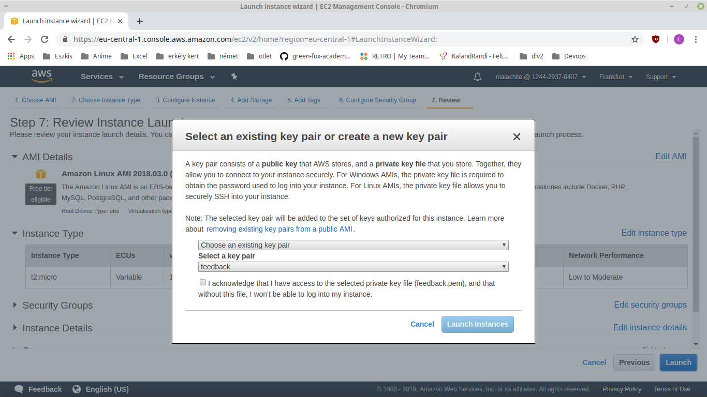

# Elastic Cloud Computing

## Prerequisites

You need an IAM user with permissions to create an EC2 instance

## Creating EC2 instance

You have to sign in to AWS, and go to "Services". Here look up EC2, or write it in to the search bar. This will bring you to the EC2's main page. It should look like this.



Here you need to click on "Launch instance" to start the whole process. The whole process will be done in NUMBER OF STEPS steps.

### Step 1: Choose an Amazon Machine Image (AMI)

For this example, you should choose "Amazon Linux AMI 2018.03.0 (HVM), SSD Volume Type". It is a Linux configuration, easy to handle.

### Step 2: Choose an Instance Type

Here you can select the instance's hardware. For this example you shoud use "t2.micro". It is cost efficient, and good enough for basic server.

### Step 3: Configure Instance Details

For now you can use the default values.

### Step 4: Add Storage

For now you can use the default values.

### Step 5: Add Tags

Tagging is optional. To add one, click on Add on the left, and enter a key-value pair.

### Step 6: Configure Security Group

On this screen you can configure firewall rules to control the traffic for your instance.

"SSH" is needed to access the instance. Since the deployed application will be a web server, "HTTP" should be allowed as well.

### Step 7: Review Instance Launch

Here you can check your settings, and change anything, if it's not good.

## Key pairs

### Create key pairs

After clicking on the "Launch" button a similar pop up should show up.



Choose Create a new key pair, name it, and then download it. WARNING: Store it in a secure and accessible location. You will not be able to download it again.

Click on "Launch Instances".

Click on "View Instances", to look at you new instannce. It could take a few minutes to actually lunch it.

### Hiding the private key file

Open the folder where your private key file is located in a terminal. Enter the following command:

```chmod 400 /path_to_key/my_key.pem```

## SSH

Note: if you are using Windows use PuTTY to create an SSH connection.

Enter the following command: 

```ssh -i /path_to_key/my_key.pem user_name@public_dns_name```

Note: Since a Linux instance was created the user name is 'ec2-user'. You can check the public DNS name of your instance on the AWS Console page after creating the instance. My command looked like this.

```ssh -i ./eszkis_ec2_test.pem ec2-user@ec2-18-184-234-140.eu-central-1.compute.amazonaws.com```

## Deploying the Nodejs application

### Prerequisites

Install node version manager (nvm) by typing the following at the command line.

`curl -o- https://raw.githubusercontent.com/creationix/nvm/v0.32.0/install.sh | bash`

Activate nvm with the command below:

`. ~/.nvm/nvm.sh`

Install Node.js with the command below:

`nvm install 4.4.5`

Note: installing Node.js also installs `npm`, so you can install additional modules from this point.

### Getting your application on your instance

One way of doing this, is by cloning a git repository containing your application to your instance. [example repo](https://github.com/green-fox-academy/malachite_ops_adam_ec2) (Note the package.json file; express is listed as a dependency of my application, so it will be installed after giving the command 'npm install')

To do this, you need to install git on your instance. The following command does that:
`sudo yum install -y git`

Then, clone the repository to your instance with this command (substitute the link with a link to your repo):
`git clone https://github.com/green-fox-academy/malachite_ops_adam_ec2.git`

Change the active directory to your repo's folder:
`cd malachite_ops_adam_ec2`

Install the dependencies needed to run your application (supposing a package.json file is present):
`npm install`

Run your application with the command
`node hello.js`

Test your application by entering your instance's url and the port number your application listens to with a browser.