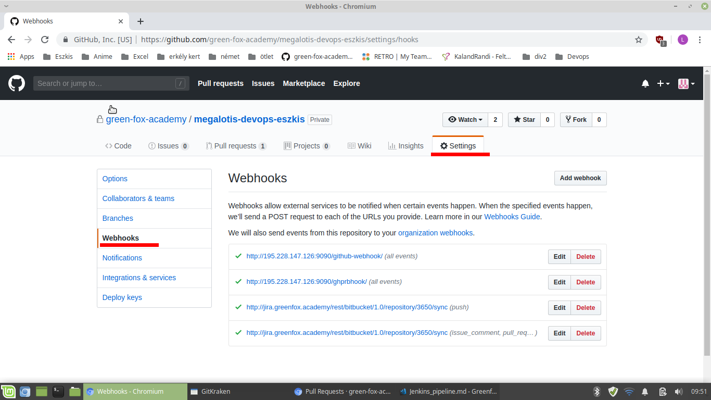

# Jenkins pipeline

For you need a running Jenkins server, and a GitHub user.

## Set up GitHub repo

You can use an existing repo, or can create a new one. After that you have to go to "Settings". Here you have to go to "Webhooks".

For now you finished with GitHub, now you have to set up your Jenkins project.

## Set up Jenkins

