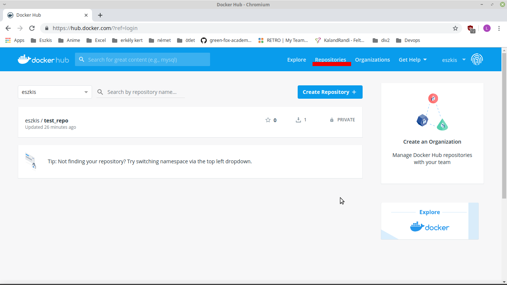

# Utilizing artifact repositories

## Create your dokcerhub repo

Go to [Dockerhub](https://hub.docker.com/) and log in with you username, and password. Then you need to go the "Repositories" menu, in the top right corner.



Here you hae to click on "Create Repository" button to start makeing your first Dockerhub repo. Here you have to give a name to you repo. After that you need to decide, what kind of visibility do you want to give to this repo. There is an optinon to connect your repo to Github or Bitbucket. After everyhing is given click on the "Create" button and your repo is complete.

## Making image ready to push
You need an image to push it to dockerhub. If you have one then you can skip the next few lines. If you dont have one you need to create one. If you have problem with creating an image, the following [link](https://docs.docker.com/develop/develop-images/baseimages/) will help you.

You have to tag, and add the repository name to the image. You can do it with a simple line of code.

``` docker tag <IMAGE ID> <REPOSITORY>:<TAG> ```

## Login to docker, and push image

After that you need to log in to your docker account through you console, with the following code.

``` docker login ```

To log in you need to give your username, and password through the console.
Now then we have an image and logined to docker we can push the image. You need to type in the following code to make it happen.

``` docker push <REPOSITORY>:<TAG> ```

It can take a several second, or even minutes to pushit, depending on your image size. 